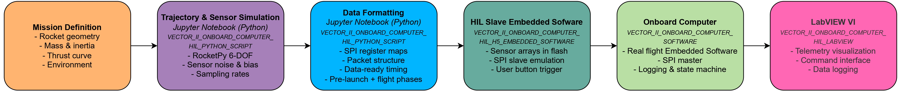
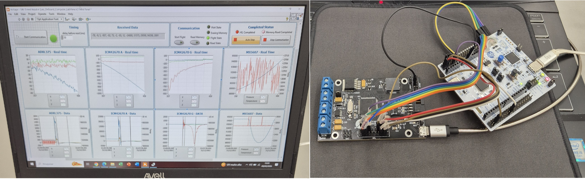
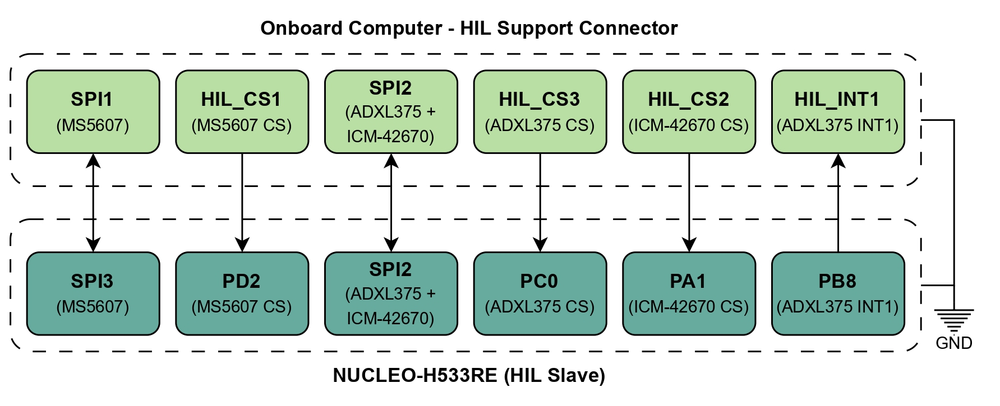
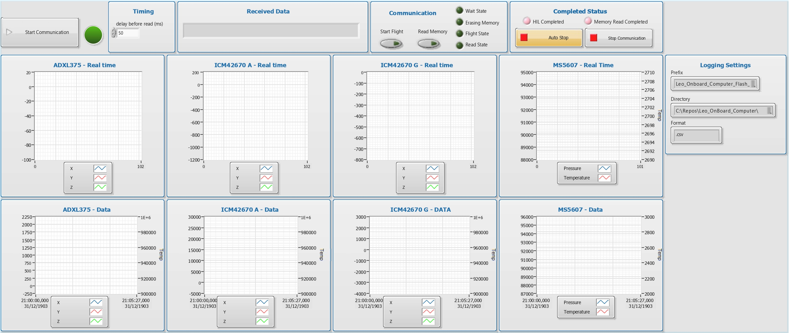
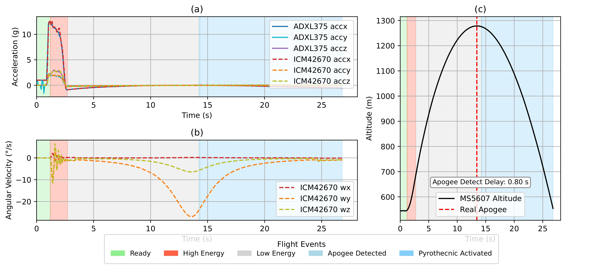

# Hardware-In-the-Loop-Simulation-Framework-for-Sounding-Rocket-Onboard-Computers

This repository serves as a documentation hub for the development of a **Hardware-In-the-Loop (HIL) validation framework** for sounding rocket onboard computers.

The platform integrates flight dynamics simulation, sensor emulation, embedded systems, and real-time telemetry to enable end-to-end validation of avionics hardware and software in laboratory environments. By reproducing realistic sensor behavior at the protocol level, the framework allows complete testing of flight software without requiring costly launch campaigns.

The project was developed at the **State University of Londrina (UEL)** and was experimentally validated using multiple onboard computer platforms developed for sounding rocket applications.

The work resulted in a peer-reviewed publication in *HardwareX (Elsevier)* and an open-access dataset released through Mendeley Data.

This repository provides:

* HIL architecture documentation
* Hardware photographs and wiring diagrams
* Flight simulation workflow
* Sensor emulation methodology
* Validation results
* Links to scientific publications
* Access to open-access datasets
* References to embedded software repositories

---

# 📚 Repository Resources

## Publications

### HardwareX (Elsevier)

**Design of an Onboard Computer for Small Experimental Rockets with an Integrated Hardware-in-the-Loop Validation Framework**

*Link will be added after publication*

---

## Open Access Dataset

The complete validation datasets, simulation scripts, embedded firmware, and supplementary documentation are publicly available through Mendeley Data:

*Link will be added after publication*

### License

Creative Commons Attribution Non Commercial 4.0 International (CC BY-NC 4.0)

Users are free to share, adapt, and build upon the material for non-commercial purposes, provided appropriate attribution is given.

---

# 🚀 Project Overview

The HIL framework was developed to support systematic validation of sounding rocket avionics without requiring physical launches.

Instead of connecting the onboard computer to real sensors, the framework reproduces the behavior of the flight sensors through an external embedded platform operating as a protocol-accurate sensor emulator.

The onboard computer executes the same firmware used during flight missions while receiving synthetic measurements generated from realistic six-degree-of-freedom rocket simulations.

This approach enables:

* Repeatable validation campaigns
* Controlled mission scenarios
* Rapid algorithm development
* Safe laboratory testing
* Verification of complete avionics systems

---

# ⭐ Key Features

* End-to-end avionics validation
* Protocol-level sensor emulation
* Realistic MEMS sensor behavior
* RocketPy-based six-degree-of-freedom simulation
* STM32H533RE sensor emulator
* Support for multiple onboard computer platforms
* Real-time telemetry visualization
* Flash memory logging validation
* Repeatable laboratory experiments
* Open-source datasets and software
* Educational and research-oriented architecture

---

# 🏗️ HIL Architecture

The framework is composed of five main elements.

### Flight Simulation

A Python environment based on RocketPy generates:

* Six-degree-of-freedom trajectories
* Vehicle dynamics
* Propulsion effects
* Aerodynamic forces
* Environmental disturbances

### Sensor Data Synthesis

Trajectory outputs are converted into realistic sensor measurements by reproducing:

* Sampling rates
* Noise density
* Sensor bias
* Resolution limits
* Full-scale ranges

### Sensor Emulation Platform

An STM32H533RE based platform operates as an SPI slave and emulates the behavior of flight sensors used by different onboard computer architectures.

The emulator reproduces:

* Register maps
* SPI transactions
* Data-ready signaling
* Timing constraints

Sensor measurements generated by the flight simulation are streamed to the onboard computer through protocol-accurate interfaces, allowing the flight software to operate exactly as it would during a real mission.

### Onboard Computer

The flight computer executes the same embedded software used in real missions, including:

* Sensor acquisition
* State machine execution
* Flight event detection
* Flash memory logging
* Telemetry transmission

### Ground Station

A LabVIEW graphical interface provides:

* Real-time telemetry visualization
* Flight-state monitoring
* Simulation control
* Flash memory retrieval
* Data logging

---

## Block Diagram

*Figure 1 – Overview of the Hardware-In-the-Loop simulation architecture.*

---

# 🔄 Validation Workflow

The complete validation process follows four stages.

### Stage 1 – Mission Definition

Rocket and environment parameters are defined:

* Vehicle geometry
* Mass properties
* Aerodynamic coefficients
* Motor thrust curve
* Launch conditions

### Stage 2 – Trajectory Generation

RocketPy computes the six-degree-of-freedom trajectory and generates synthetic sensor measurements.

### Stage 3 – Sensor Emulation

The generated data are formatted according to the original sensor communication protocols and stored in the STM32H533RE flash memory.

### Stage 4 – Real-Time Execution

The onboard computer interacts with the emulator exactly as it would with real sensors while telemetry is monitored through LabVIEW.

---

## Workflow Diagram

*Figure 2 – Hardware-In-the-Loop validation workflow.*

---

# 🖼️ Hardware Photos

| Laboratory Setup               | Wiring Interface                 |
| ------------------------------ | -------------------------------- | -------------------------------- |
|  |  | 

*Figure 3 – Hardware used during Hardware-In-the-Loop validation campaigns.*

---

# 🛰️ Supported Sensors

The current implementation supports multiple sensing architectures commonly used in sounding rocket onboard computers.

| Category | Sensors |
|-----------|----------|
| High-g Accelerometers | ADXL375 |
| Precision Accelerometers | ADXL357 |
| Inertial Measurement Units | ICM42670, ASM330 |
| Barometers | MS5607, MS5611 |

Future versions may include:

* MMC5983MA magnetometer
* GNSS receivers
* Additional navigation sensors

# 🖥️ LabVIEW Ground Station

The LabVIEW graphical interface provides real-time telemetry visualization, simulation control, flight-state monitoring, and flash memory retrieval.

*Figure 4 – LabVIEW graphical interface used for telemetry visualization and flash memory retrieval.*

---

# 📈 Experimental Validation

The framework was used to validate critical avionics functions under both nominal and perturbed mission conditions.

Evaluated scenarios included:

* Nominal flight
* Turbulent wind profiles
* Increased vehicle mass
* Increased aerodynamic drag
* Combined disturbances
* Reduced propellant mass

### Apogee Detection Performance

| Scenario                          | Detection Delay |
| --------------------------------- | --------------- |
| Standard Conditions               | 0.80 s          |
| Turbulent Wind Profile            | 0.88 s          |
| Increased Rocket Mass (+50%)      | 0.72 s          |
| Increased Drag Coefficient (+50%) | 0.80 s          |
| Combined Disturbances             | 0.72 s          |
| Reduced Propellant Mass (-50%)    | 0.72 s          |

Across all evaluated cases, apogee detection remained below one second, demonstrating robust performance under significant deviations from nominal mission conditions.

---

## Example Validation Results

*Figure 5 – Example Hardware-In-the-Loop simulation showing acceleration, angular velocity, altitude, and flight-state transitions.*

---

# 🔬 Applications

The framework can be used for:

* Avionics development
* Flight software validation
* State estimation research
* Flight event detection algorithms
* Recovery system testing
* Educational aerospace laboratories
* Rapid prototyping of rocket electronics

---

# 📦 Related Repositories

Several repositories associated with this project are available separately.

## Embedded Drivers

Open-source drivers used throughout the project.

* [ADXL375 STM32 HAL Driver](https://github.com/NathanNetzel/ADXL375-STM32-HAL-Driver) 
* [ADXL357 STM32 HAL Driver](https://github.com/NathanNetzel/ADXL357-STM32-HAL-Driver)
* [ICM42670 STM32 HAL Driver](https://github.com/NathanNetzel/ICM42670-STM32-HAL-Driver)
* [MS5607 STM32 HAL Driver](https://github.com/NathanNetzel/MS5607-STM32-HAL-Driver)
* [MS5611 STM32 HAL Driver](https://github.com/NathanNetzel/MS5611-STM32-HAL-Driver)

Additional repositories will be referenced as they become publicly available.

---

# 📖 Citation

If this repository, dataset, or associated publications contribute to your work, please cite the corresponding HardwareX publication.

---

## Author

Nathan Netzel

Electrical Engineering Student
State University of Londrina (UEL)

